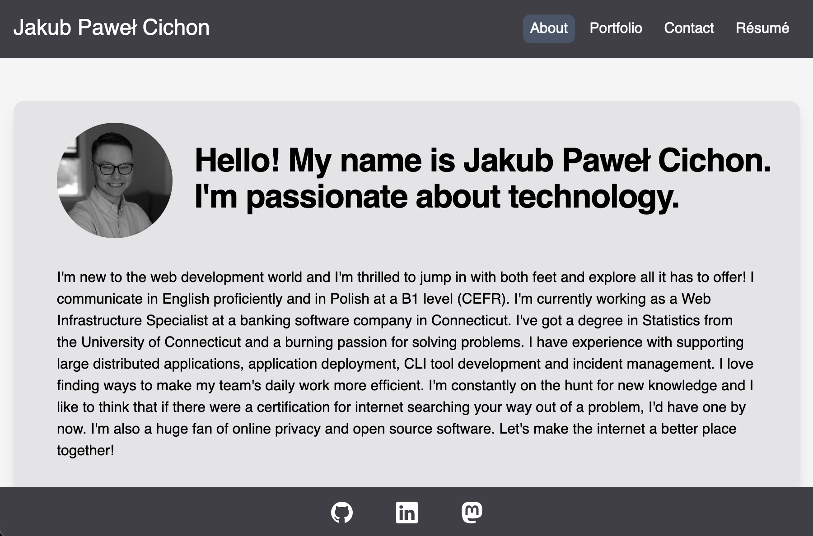
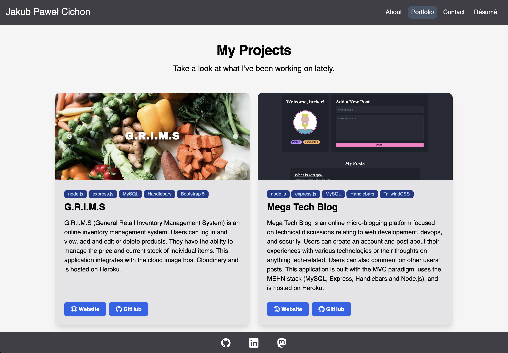
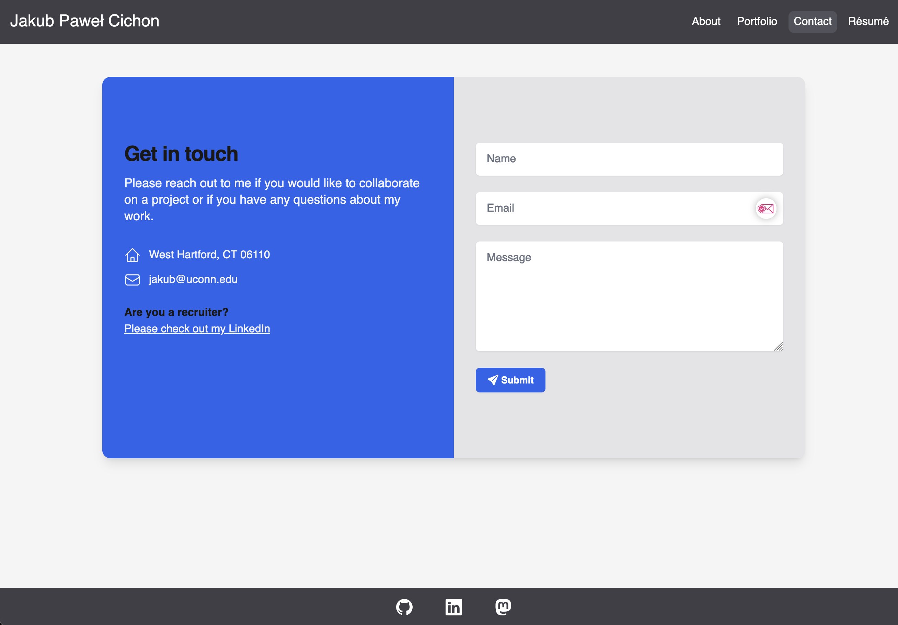
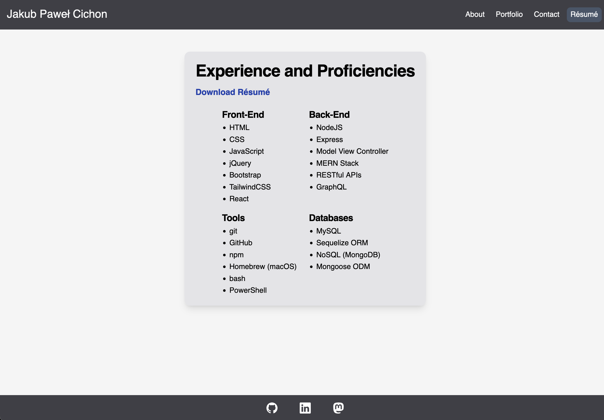

# Portfolio Site

 

 

## Table of Contents

- [Description](#description)
- [Showcase](#showcase)
  - [About](#about)
  - [Portfolio](#portfolio)
  - [Contact](#contact)
  - [Résumé](#resume)
- [Future Development](#future-development)
- [Credits](#credits)
- [License](#license)

## Description

This is my personal web development portfolio site! It contains a brief introduction about me, a portfolio of my projects, a contact form, and a résumé section listing my proficiencies. The site is built with React and TailwindCSS. It is deployed on Githib Pages. The site is fully responsive and works on mobile devices. You can access the site [here](https://jakubcic.github.io/portfolio-site/)!

 

## Usage

### About

The about section contains a brief introduction about me!
 

### Portfolio

The portfolio section is a showcase of my projects. My recent projects are displayed here with an image, description, and links to the live site and the GitHub repository all on a beautiful card. These cards are responsive and will adjust to the size of the screen.
 

### Contact

The contact section contains a form that does some input validation. Currently the form does not actually send an email, but it will in the future! I plan to create a small backsend email relay service that will send the email to my actual email address.
 

### Resume

The resume section contains a list of my proficiencies. This section is still a work in progress and will be updated as I learn more skills! There is also a link to download my résumé as a PDF.
 

## Future Development

- [ ] Flesh out about page with some stats from my GitHub profile
- [ ] Add more projects and pagination to the portfolio page!
- [ ] Create a back end for the contact form to send emails
- [ ] Add a blog section to share my writing

## Credits

This application uses the following open source technologies:

- [React](https://reactjs.org/)
- [React Router for client side routing ](https://reactrouter.com/)
- [TailwindCSS for styling](https://tailwindcss.com/)
- [PostCSS](https://postcss.org/)
- [Vite for bundling](https://vitejs.dev/)

 

## License

This application is covered under the [GNU GPLv3 License](https://choosealicense.com/licenses/gpl-3.0/).
